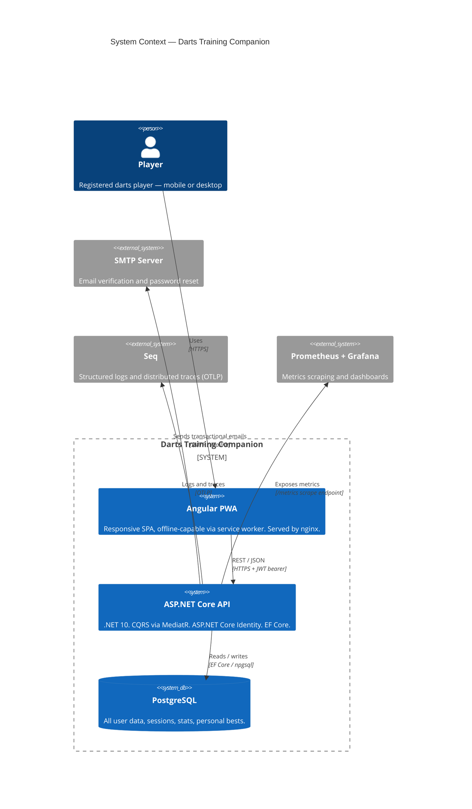

# Technical Analysis — Darts Training Companion

---

## Table of Contents

1. [Introduction & Scope](#1-introduction--scope)
2. [Platform Choices](#2-platform-choices)
3. [Architecture Overview](#3-architecture-overview)
4. [Solution Structure](#4-solution-structure)
5. [Domain Model & Data Entities](#5-domain-model--data-entities)
6. [CQRS Design](#6-cqrs-design)
7. [API Endpoints](#7-api-endpoints)
8. [FluentValidation Design](#8-fluentvalidation-design)
9. [Observability](#9-observability)
10. [Security Implementation](#10-security-implementation)
11. [Infrastructure & Deployment](#11-infrastructure--deployment)
12. [CI/CD Pipeline](#12-cicd-pipeline)
13. [Local Development](#13-local-development)
14. [Documentation Framework](#14-documentation-framework)
15. [Release Notes Framework](#15-release-notes-framework)
16. [Open Questions](#16-open-questions)
17. [KISS & YAGNI Validation Report](#17-kiss--yagni-validation-report)

---

## 1. Introduction & Scope

This Technical Analysis translates the functional requirements defined in **FA-darts-training-companion.md (v1.8)** into a concrete technical design for the **Darts Training Companion** system.

### In scope (MVP — v1.0)

- User registration, email verification, login, password reset, profile management, and account deletion via ASP.NET Core Identity
- Game session tracking for 501, 301, Cricket (pass-and-play + solo drill), and Number Focus
- Offline-capable Angular PWA with service worker and localStorage-based in-progress session auto-save
- Multi-device sync with server-side conflict detection and client-driven resolution
- Statistics dashboard, trend charts, personal bests, and Number Focus heat grid
- Responsive desktop layout with enhanced charts and data export (CSV / Excel / JSON)
- Docker Compose deployment on a private server

### Out of scope (v1.0)

- Training drills (Module 3 — Post-MVP)
- Leaderboards and social sharing (Module 5 — Post-MVP)
- Session drill-down / replay view (FR-D-04 — Post-MVP)
- Side-by-side game mode comparison (FR-D-03 — Post-MVP)
- Guest mode (FR-P-05 — Post-MVP)
- Third-party OAuth (Google, etc.)
- Azure infrastructure (POC runs on private server)

### Key constraints

- PWA must be fully functional offline for all non-sync features (FA §12.2)
- First interactive load ≤ 3 s on 4G; subsequent loads ≤ 1 s (FA §12.1)
- Score entry response ≤ 100 ms (FA §12.1)
- GDPR: data export and account deletion required (FA §12.5)
- Single environment for POC — dev/staging/prod separation is post-POC

---

## 2. Platform Choices

| Concern                           | Choice                                                  | Notes                                                                                                    |
| --------------------------------- | ------------------------------------------------------- | -------------------------------------------------------------------------------------------------------- |
| **Backend**                       | .NET 10 / ASP.NET Core Web API                          | Latest LTS                                                                                               |
| **Frontend**                      | Angular 21 PWA                                          | `@angular/pwa` for service worker and manifest                                                           |
| **Authentication**                | ASP.NET Core Identity + JWT bearer                      | Email/password only in MVP; external providers (Google) added via Identity post-MVP                      |
| **Database**                      | PostgreSQL 16 in Docker                                 | EF Core 10, code-first migrations                                                                        |
| **Hosting**                       | Docker Compose on private server                        | POC; Azure or other cloud migration post-POC                                                             |
| **CI/CD**                         | GitHub Actions — self-hosted runner                     | Runner installed on private server                                                                       |
| **Observability — metrics**       | Prometheus + Grafana                                    | Prometheus scrapes `/metrics` endpoint; Grafana dashboards                                               |
| **Observability — logs & traces** | Seq (OTLP)                                              | All three OTel signals; self-hosted Docker                                                               |
| **Environments**                  | Single (`prod` on private server)                       | POC; multi-env added when going public                                                                   |
| **Secrets**                       | Docker `.env` file (POC) → Azure Key Vault (production) | POC uses `.env`; production on Azure Container Apps uses `DefaultAzureCredential` + Key Vault references |
| **SMTP**                          | Mailhog (dev/POC) → configurable SMTP (production)      | Mailhog catches all outbound email locally; production SMTP server configured via environment variables  |

---

## 3. Architecture Overview



### Key architectural decisions

- **CQRS via MediatR** at the application layer. No separate read/write databases — a single PostgreSQL instance is sufficient for the POC load. See ADR `arch-001`.
- **ASP.NET Core Identity** manages user accounts and password hashing. JWT bearer tokens (short-lived, 15 min) + refresh tokens (7 days, stored as hashed values in the DB) handle session management.
- **Offline-first PWA**: The Angular service worker caches static assets and select API GET responses. In-progress game sessions are persisted to `localStorage`; completed sessions are queued in `IndexedDB` when offline. The `SyncService` detects connectivity by pinging `GET /api/health` (more reliable than `navigator.onLine`). Sync is triggered automatically on reconnect and manually by the user. The sync operation is all-or-nothing — if `POST /api/sessions/sync` fails or is incomplete, the entire batch is retried; the backend only persists sessions when the full sync completes successfully.
- **Stats recalculation** on session delete runs asynchronously via an in-process `BackgroundService` fed by a `Channel<Guid>`. The handler enqueues the user ID and returns immediately; the Angular app polls `GET /api/stats/recalculation-status` until complete.
- **Data export** is generated server-side (guarantees completeness across devices) by a `BackgroundService` export job. The client polls `GET /api/export/{jobId}` for status and downloads when ready.

---

## 4. Solution Structure

```
DartsCompanion.sln
├── src/
│   ├── DartsCompanion.Api/             # ASP.NET Core Web API — controllers, Program.cs, middleware
│   ├── DartsCompanion.Application/     # MediatR commands, queries, validators, DTOs
│   ├── DartsCompanion.Domain/          # Entities, enums, domain constants
│   ├── DartsCompanion.Infrastructure/  # EF Core DbContext, Identity, email sender, ExcelExportWriter, export generation
│   └── DartsCompanion.Web/             # Angular 21 PWA (or separate repo)
│       └── src/app/shared/charts/      # Chart wrapper components (TrendChartComponent, SessionBarChartComponent,
│                                       #   NumberFocusHeatGridComponent, WeeklyBarChartComponent)
├── tests/
│   ├── DartsCompanion.UnitTests/
│   └── DartsCompanion.IntegrationTests/
├── docker/
│   ├── docker-compose.yml              # Full stack (used for both local dev and server deployment)
│   ├── docker-compose.override.yml     # Local dev overrides (hot-reload, exposed ports, bind mounts)
│   ├── prometheus.yml                  # Prometheus scrape config
│   └── nginx.conf                      # Reverse proxy + SSL termination
└── docs/
    ├── adr/                            # Architecture Decision Records
    └── api/                            # OpenAPI spec (openapi.json)
```

### Backend application structure (example)

The backend follows a feature-folder convention within each layer. Each Command is co-located with its handler and validator:

```
src/
├── DartsCompanion.Api/
│   ├── Controllers/
│   │   ├── AuthController.cs
│   │   ├── ProfileController.cs
│   │   ├── SessionsController.cs
│   │   ├── StatsController.cs
│   │   └── ExportController.cs
│   ├── Middleware/
│   │   └── ExceptionHandlingMiddleware.cs
│   └── Program.cs
│
├── DartsCompanion.Application/
│   ├── Auth/
│   │   ├── Commands/
│   │   │   ├── RegisterUser/
│   │   │   │   ├── RegisterUserCommand.cs
│   │   │   │   ├── RegisterUserCommandHandler.cs
│   │   │   │   └── RegisterUserCommandValidator.cs
│   │   │   └── ...                          # One folder per Command
│   │   └── Queries/
│   │       └── Login/
│   │           ├── LoginQuery.cs
│   │           └── LoginQueryHandler.cs
│   ├── Sessions/
│   │   ├── Commands/                        # CreateSession, DeleteSession, SyncSessions, ResolveConflict
│   │   └── Queries/                         # GetSessionHistory, GetSessionDetail, GetPendingConflicts
│   ├── Stats/
│   │   ├── Commands/                        # (none for MVP)
│   │   └── Queries/                         # GetStatsDashboard, GetTrendData, GetPersonalBests, etc.
│   ├── Export/
│   │   ├── Commands/                        # RequestExport
│   │   └── Queries/                         # GetExportStatus, DownloadExport
│   ├── Common/
│   │   ├── Behaviours/
│   │   │   └── ValidationBehaviour.cs
│   │   ├── DTOs/                            # Shared response DTOs (TokenDto, PagedResult<T>, etc.)
│   │   └── Interfaces/
│   │       ├── IEmailSender.cs
│   │       └── IExcelExportWriter.cs
│   └── ApplicationAssemblyMarker.cs
│
├── DartsCompanion.Domain/
│   ├── Entities/
│   │   ├── ApplicationUser.cs
│   │   ├── RefreshToken.cs
│   │   ├── GameSession.cs
│   │   ├── Turn.cs
│   │   ├── CricketTurn.cs
│   │   ├── DartEntry.cs
│   │   ├── UserStats.cs
│   │   ├── PersonalBest.cs
│   │   └── ExportJob.cs
│   └── Enums/
│       ├── GameMode.cs
│       ├── DartOutcome.cs
│       ├── ExportFormat.cs
│       └── ExportStatus.cs
│
└── DartsCompanion.Infrastructure/
    ├── Persistence/
    │   ├── AppDbContext.cs
    │   ├── Migrations/
    │   └── Configurations/                  # EF Core IEntityTypeConfiguration<T> per entity
    ├── Identity/
    │   └── IdentitySeeder.cs
    ├── Email/
    │   └── MailKitEmailSender.cs            # Implements IEmailSender
    ├── Export/
    │   └── ExcelExportWriter.cs             # Implements IExcelExportWriter
    └── BackgroundServices/
        ├── StatsRecalculationService.cs     # BackgroundService + Channel<Guid>
        └── ExportJobService.cs              # BackgroundService; delegates to ExcelExportWriter
```

### Angular app structure (example)

Angular 21 uses fully standalone components — no NgModules. Features are organised by domain under `features/`, with shared chart wrappers in `shared/charts/`:

```
src/DartsCompanion.Web/src/
├── app/
│   ├── core/
│   │   ├── auth/
│   │   │   ├── auth.service.ts              # JWT + refresh token management
│   │   │   ├── auth.guard.ts                # Route guard
│   │   │   └── token.interceptor.ts         # Attaches Bearer token; handles 401 refresh
│   │   ├── sync/
│   │   │   └── sync.service.ts              # Health ping, IndexedDB queue, POST /api/sessions/sync
│   │   └── api/
│   │       └── api-client.service.ts        # Typed wrappers over HttpClient per resource
│   │
│   ├── features/
│   │   ├── auth/
│   │   │   ├── login/
│   │   │   ├── register/
│   │   │   └── reset-password/
│   │   ├── game/
│   │   │   ├── mode-501/                    # Score input, bust detection, checkout prompts
│   │   │   ├── mode-301/
│   │   │   ├── cricket/                     # Pass-and-play + solo drill
│   │   │   └── number-focus/                # Per-dart outcome entry
│   │   ├── stats/
│   │   │   ├── dashboard/                   # KPI cards, PB slots, weekly summary
│   │   │   └── trends/                      # Trend + bar charts with metric selector
│   │   ├── history/                         # Paginated session list
│   │   ├── profile/                         # Profile form, preferences, account deletion
│   │   └── export/                          # Format selector, scope picker, download poller
│   │
│   ├── shared/
│   │   ├── charts/
│   │   │   ├── trend-chart/
│   │   │   │   └── trend-chart.component.ts # Wraps Chart.js line chart; @Input() data contract
│   │   │   ├── session-bar-chart/
│   │   │   │   └── session-bar-chart.component.ts
│   │   │   ├── number-focus-heat-grid/
│   │   │   │   └── number-focus-heat-grid.component.ts
│   │   │   └── weekly-bar-chart/
│   │   │       └── weekly-bar-chart.component.ts
│   │   ├── components/
│   │   │   ├── score-input/                 # Reusable dart score entry widget
│   │   │   └── sync-banner/                 # Offline indicator + manual sync trigger
│   │   └── models/                          # Shared TypeScript interfaces (SessionDto, StatsDto, etc.)
│   │
│   ├── app.config.ts                        # provideRouter, provideHttpClient, provideServiceWorker
│   ├── app.routes.ts                        # Lazy-loaded feature routes
│   └── app.component.ts
│
├── environments/
│   ├── environment.ts
│   └── environment.prod.ts
├── manifest.webmanifest                     # PWA manifest — name, icons, display: standalone
└── ngsw-config.json                         # Service worker cache strategy config
```

**Layer rules:**
- `Api` depends on `Application` only. No direct EF Core or domain access in controllers.
- `Application` depends on `Domain` only. No EF Core references — infrastructure accessed via interfaces.
- `Infrastructure` depends on `Application` and `Domain`. Implements interfaces defined in `Application`.
- `Domain` has no dependencies.

---

## 5. Domain Model & Data Entities

### Entity: ApplicationUser *(extends IdentityUser\<Guid\>)*

| Field | Type | Required | Notes |
|---|---|---|---|
| Id | Guid | Yes | PK — provided by Identity |
| Email | string | Yes | From IdentityUser; unique |
| DisplayName | string | Yes | Max 100; shown on leaderboards |
| DominantHand | Hand? (enum) | No | Left / Right |
| PreferredGameMode | GameMode? (enum) | No | User preference |
| TargetAverage | decimal? | No | Personal goal |
| WeekStartDay | DayOfWeek | Yes | Default: Monday |
| HomeScreenPbMetricKey | string? | No | Key of the configurable 4th PB slot |
| LeaderboardOptIn | bool | Yes | Default: false |
| IsDeleted | bool | Yes | Soft delete flag |
| DeletedAt | DateTimeOffset? | No | Set on account deletion |
| CreatedAt | DateTimeOffset | Yes | Audit |
| UpdatedAt | DateTimeOffset | Yes | Audit |

**Notes:** Password hash, email confirmation token, and security stamp are managed by ASP.NET Core Identity on `IdentityUser<Guid>`.

---

### Entity: RefreshToken

| Field | Type | Required | Notes |
|---|---|---|---|
| Id | Guid | Yes | PK |
| UserId | Guid | Yes | FK → ApplicationUser |
| TokenHash | string | Yes | SHA-256 hash of the raw token |
| ExpiresAt | DateTimeOffset | Yes | 7-day lifetime |
| IsRevoked | bool | Yes | Set on logout or rotation |
| CreatedAt | DateTimeOffset | Yes | Audit |

---

### Entity: GameSession

| Field | Type | Required | Notes |
|---|---|---|---|
| Id | Guid | Yes | PK |
| UserId | Guid | Yes | FK → ApplicationUser |
| GameMode | GameMode (enum) | Yes | Mode501, Mode301, Cricket, NumberFocus |
| StartedAt | DateTimeOffset | Yes | |
| CompletedAt | DateTimeOffset | Yes | |
| Player2Name | string? | No | Pass-and-play only; max 100 |
| ConfigurationJson | string | Yes | JSONB — game-specific config (starting score, double-in flag, NF target number, NF dart count, Cricket target score) |
| IsDeleted | bool | Yes | Soft delete |
| CreatedAt | DateTimeOffset | Yes | Audit |

**Relationships:**
- GameSession has many Turn (501/301 sessions)
- GameSession has many CricketTurn (Cricket sessions)
- GameSession has many DartEntry (Number Focus sessions)

---

### Entity: Turn *(501 / 301)*

| Field | Type | Required | Notes |
|---|---|---|---|
| Id | Guid | Yes | PK |
| SessionId | Guid | Yes | FK → GameSession |
| TurnNumber | int | Yes | 1-based |
| PlayerIndex | int | Yes | 0 = player 1, 1 = player 2 |
| Score | int | Yes | Total score for this 3-dart turn |
| RemainingScore | int | Yes | Score remaining after this turn |
| IsBust | bool | Yes | True if turn was voided as a bust |

---

### Entity: CricketTurn

| Field | Type | Required | Notes |
|---|---|---|---|
| Id | Guid | Yes | PK |
| SessionId | Guid | Yes | FK → GameSession |
| TurnNumber | int | Yes | 1-based |
| PlayerIndex | int | Yes | 0 = player 1, 1 = player 2 |
| MarksN15 | int | Yes | 0–3 marks on 15 this turn |
| MarksN16 | int | Yes | |
| MarksN17 | int | Yes | |
| MarksN18 | int | Yes | |
| MarksN19 | int | Yes | |
| MarksN20 | int | Yes | |
| MarksBull | int | Yes | |
| PointsScored | int | Yes | Points scored on open numbers this turn |

---

### Entity: DartEntry *(Number Focus)*

| Field | Type | Required | Notes |
|---|---|---|---|
| Id | Guid | Yes | PK |
| SessionId | Guid | Yes | FK → GameSession |
| DartNumber | int | Yes | 1-based position within the set |
| Outcome | DartOutcome (enum) | Yes | Triple, Double, Single, Miss |

---

### Entity: UserStats

Stores computed/cached aggregate statistics per user per game mode. Recalculated from scratch on session delete.

| Field | Type | Required | Notes |
|---|---|---|---|
| Id | Guid | Yes | PK |
| UserId | Guid | Yes | FK → ApplicationUser; unique per (UserId, GameMode) |
| GameMode | GameMode (enum) | Yes | |
| StatsJson | string | Yes | JSONB — all computed metrics for this mode |
| IsRecalculating | bool | Yes | True while background recalculation is running |
| LastCalculatedAt | DateTimeOffset | Yes | |

---

### Entity: PersonalBest

| Field | Type | Required | Notes |
|---|---|---|---|
| Id | Guid | Yes | PK |
| UserId | Guid | Yes | FK → ApplicationUser |
| MetricKey | string | Yes | e.g. `avg_3dart_501`, `nf_accuracy_20`, `nf_weighted_accuracy_bull` |
| Value | decimal | Yes | |
| AchievedAt | DateTimeOffset | Yes | |
| SessionId | Guid? | No | FK → GameSession; nullable for aggregated metrics |

---

### Entity: ExportJob

| Field | Type | Required | Notes |
|---|---|---|---|
| Id | Guid | Yes | PK |
| UserId | Guid | Yes | FK → ApplicationUser |
| Status | ExportStatus (enum) | Yes | Pending, Processing, Complete, Failed |
| Format | ExportFormat (enum) | Yes | Csv, Excel, Json |
| ScopeJson | string | Yes | JSONB — scope options (all/mode/date/currentView) |
| FilePath | string? | No | Server-side temp path; populated when complete |
| RequestedAt | DateTimeOffset | Yes | |
| CompletedAt | DateTimeOffset? | No | |

**Database notes:**
- All entities use soft deletes via `IsDeleted` flag. No hard deletes except ExportJob temp files.
- `ConfigurationJson` and `StatsJson` use PostgreSQL `jsonb` column type via EF Core value conversion.
- Composite unique index on `(UserId, GameMode)` for `UserStats`.
- Composite index on `(UserId, IsDeleted, CompletedAt DESC)` on `GameSession` for history queries.

---

## 6. CQRS Design

All Commands and Queries are dispatched via `IMediator.Send()`. Handlers live in `Application/[Domain]/Commands/` and `Application/[Domain]/Queries/`. No business logic in controllers or entities.

### Commands (writes)

| Command | Description | Triggered by | Returns |
|---|---|---|---|
| `RegisterUserCommand` | Creates account, sends verification email | POST /api/auth/register | `Guid` (UserId) |
| `VerifyEmailCommand` | Activates account via token | POST /api/auth/verify-email | `Unit` |
| `ResendVerificationEmailCommand` | Resends verification email | POST /api/auth/resend-verification | `Unit` |
| `RequestPasswordResetCommand` | Sends password reset link | POST /api/auth/forgot-password | `Unit` |
| `ResetPasswordCommand` | Sets new password via reset token | POST /api/auth/reset-password | `Unit` |
| `RefreshTokenCommand` | Issues new JWT using refresh token | POST /api/auth/refresh | `TokenDto` |
| `RevokeRefreshTokenCommand` | Revokes refresh token (logout) | POST /api/auth/logout | `Unit` |
| `UpdateProfileCommand` | Updates profile fields and preferences | PUT /api/profile | `Unit` |
| `DeleteAccountCommand` | Soft-deletes account; data remains in DB indefinitely (purge job is post-MVP) | DELETE /api/profile | `Unit` |
| `CreateSessionCommand` | Saves a completed game session with all turns/darts | POST /api/sessions | `Guid` (SessionId) |
| `DeleteSessionCommand` | Soft-deletes session, enqueues stat recalculation | DELETE /api/sessions/{id} | `Unit` |
| `SyncSessionsCommand` | Bulk-uploads sessions accumulated offline | POST /api/sessions/sync | `SyncResultDto` |
| `ResolveConflictCommand` | Applies user decision for a sync conflict | POST /api/sessions/conflicts/resolve | `Unit` |
| `RequestExportCommand` | Creates an ExportJob and queues file generation | POST /api/export | `Guid` (JobId) |

### Queries (reads)

| Query | Description | Triggered by | Returns |
|---|---|---|---|
| `LoginQuery` | Validates credentials, issues JWT + refresh token | POST /api/auth/login | `TokenDto` |
| `GetProfileQuery` | Returns user profile and preferences | GET /api/profile | `ProfileDto` |
| `GetSessionHistoryQuery` | Returns paginated list of completed sessions | GET /api/sessions | `PagedResult<SessionSummaryDto>` |
| `GetSessionDetailQuery` | Returns full session with all turns/darts | GET /api/sessions/{id} | `SessionDetailDto` |
| `GetPendingConflictsQuery` | Returns unresolved sync conflicts | GET /api/sessions/conflicts | `ConflictDto[]` |
| `GetStatsDashboardQuery` | Returns KPIs for the selected time range and game mode | GET /api/stats | `StatsDashboardDto` |
| `GetTrendDataQuery` | Returns time-series data for a selected metric | GET /api/stats/trends | `TrendDataDto` |
| `GetPersonalBestsQuery` | Returns all-time best values for all tracked metrics | GET /api/stats/personal-bests | `PersonalBestsDto` |
| `GetNumberFocusStatsQuery` | Returns NF stats for a specific target number | GET /api/stats/number-focus/{number} | `NumberFocusStatsDto` |
| `GetWeeklyStatsQuery` | Returns the current and prior week summary | GET /api/stats/weekly | `WeeklyStatsDto` |
| `GetRecalculationStatusQuery` | Returns whether stat recalculation is in progress | GET /api/stats/recalculation-status | `RecalculationStatusDto` |
| `GetExportStatusQuery` | Returns the status of an export job | GET /api/export/{jobId} | `ExportStatusDto` |
| `DownloadExportQuery` | Streams the completed export file | GET /api/export/{jobId}/download | `FileStreamResult` |

---

## 7. API Endpoints

All endpoints require a valid JWT bearer token unless marked `[AllowAnonymous]`. The single role in this consumer app is **`Player`** — authenticated users. All authenticated endpoints implicitly scope to the requesting user's data; no cross-user data access is permitted.

| Method | Route | Command / Query | Auth | Notes |
|---|---|---|---|---|
| GET | `/api/health` | — | Anonymous | Liveness check; used by `SyncService` for connectivity detection |
| POST | `/api/auth/register` | `RegisterUserCommand` | Anonymous | Returns 201 + UserId |
| POST | `/api/auth/verify-email` | `VerifyEmailCommand` | Anonymous | Token in request body |
| POST | `/api/auth/resend-verification` | `ResendVerificationEmailCommand` | Anonymous | Rate-limited |
| POST | `/api/auth/login` | `LoginQuery` | Anonymous | Returns JWT + refresh token |
| POST | `/api/auth/refresh` | `RefreshTokenCommand` | Anonymous | Rotates refresh token |
| POST | `/api/auth/logout` | `RevokeRefreshTokenCommand` | Player | Revokes refresh token |
| POST | `/api/auth/forgot-password` | `RequestPasswordResetCommand` | Anonymous | Always returns 200 (no enumeration) |
| POST | `/api/auth/reset-password` | `ResetPasswordCommand` | Anonymous | Token + new password in body |
| GET | `/api/profile` | `GetProfileQuery` | Player | |
| PUT | `/api/profile` | `UpdateProfileCommand` | Player | Returns 204 |
| DELETE | `/api/profile` | `DeleteAccountCommand` | Player | Email confirmation in body; returns 204 |
| GET | `/api/sessions` | `GetSessionHistoryQuery` | Player | `?page=1&pageSize=20&mode=501` |
| GET | `/api/sessions/{id}` | `GetSessionDetailQuery` | Player | 404 if not found or not owner |
| POST | `/api/sessions` | `CreateSessionCommand` | Player | Returns 201 + SessionId |
| DELETE | `/api/sessions/{id}` | `DeleteSessionCommand` | Player | Returns 204; enqueues recalculation |
| POST | `/api/sessions/sync` | `SyncSessionsCommand` | Player | Bulk sync; returns conflicts if any |
| GET | `/api/sessions/conflicts` | `GetPendingConflictsQuery` | Player | |
| POST | `/api/sessions/conflicts/resolve` | `ResolveConflictCommand` | Player | Returns 204 |
| GET | `/api/stats` | `GetStatsDashboardQuery` | Player | `?range=30d&mode=501` |
| GET | `/api/stats/trends` | `GetTrendDataQuery` | Player | `?metric=avg_3dart&mode=501&range=90d` |
| GET | `/api/stats/personal-bests` | `GetPersonalBestsQuery` | Player | |
| GET | `/api/stats/number-focus/{number}` | `GetNumberFocusStatsQuery` | Player | `{number}` = 1–20 or `bull` |
| GET | `/api/stats/weekly` | `GetWeeklyStatsQuery` | Player | |
| GET | `/api/stats/recalculation-status` | `GetRecalculationStatusQuery` | Player | Polled by client after session delete |
| POST | `/api/export` | `RequestExportCommand` | Player | Returns 202 + JobId |
| GET | `/api/export/{jobId}` | `GetExportStatusQuery` | Player | |
| GET | `/api/export/{jobId}/download` | `DownloadExportQuery` | Player | Streams file; 404 if not complete |

---

## 8. FluentValidation Design

Validation is applied to all Commands via a MediatR `ValidationBehaviour` pipeline. Validators are auto-registered from the Application assembly. Queries are not validated.

### ValidationBehaviour registration

```csharp
// Program.cs
builder.Services.AddValidatorsFromAssembly(typeof(ApplicationAssemblyMarker).Assembly);
builder.Services.AddMediatR(cfg =>
{
    cfg.RegisterServicesFromAssembly(typeof(ApplicationAssemblyMarker).Assembly);
    cfg.AddBehavior(typeof(IPipelineBehavior<,>), typeof(ValidationBehaviour<,>));
});
```

Validation failures return HTTP 400 with a structured `ProblemDetails` error body.

### Validators

| Command | Validator | Key rules |
|---|---|---|
| `RegisterUserCommand` | `RegisterUserCommandValidator` | `Email`: NotEmpty, EmailAddress, MaxLength(200); `Password`: NotEmpty, MinLength(8), MaxLength(100); `DisplayName`: NotEmpty, MaxLength(100) |
| `VerifyEmailCommand` | `VerifyEmailCommandValidator` | `UserId`: NotEmpty; `Token`: NotEmpty |
| `ResendVerificationEmailCommand` | `ResendVerificationEmailCommandValidator` | `Email`: NotEmpty, EmailAddress |
| `RequestPasswordResetCommand` | `RequestPasswordResetCommandValidator` | `Email`: NotEmpty, EmailAddress |
| `ResetPasswordCommand` | `ResetPasswordCommandValidator` | `UserId`: NotEmpty; `Token`: NotEmpty; `NewPassword`: NotEmpty, MinLength(8), MaxLength(100) |
| `RefreshTokenCommand` | `RefreshTokenCommandValidator` | `RefreshToken`: NotEmpty |
| `RevokeRefreshTokenCommand` | `RevokeRefreshTokenCommandValidator` | `RefreshToken`: NotEmpty |
| `UpdateProfileCommand` | `UpdateProfileCommandValidator` | `DisplayName`: NotEmpty, MaxLength(100); `TargetAverage`: GreaterThan(0) when provided; `WeekStartDay`: IsInEnum |
| `DeleteAccountCommand` | `DeleteAccountCommandValidator` | `ConfirmationEmail`: NotEmpty, EmailAddress |
| `CreateSessionCommand` | `CreateSessionCommandValidator` | `GameMode`: IsInEnum; `StartedAt`: NotEmpty; `CompletedAt`: NotEmpty, GreaterThan(StartedAt); `Turns` (if 501/301/Cricket): NotEmpty; `DartEntries` (if NumberFocus): NotEmpty, Count must match configured set size |
| `DeleteSessionCommand` | `DeleteSessionCommandValidator` | `SessionId`: NotEmpty |
| `SyncSessionsCommand` | `SyncSessionsCommandValidator` | `Sessions`: NotEmpty, MaxCount(100) |
| `ResolveConflictCommand` | `ResolveConflictCommandValidator` | `ConflictId`: NotEmpty; `Resolution`: IsInEnum (KeepBoth, KeepLocal, KeepRemote, KeepNeither) |
| `RequestExportCommand` | `RequestExportCommandValidator` | `Format`: IsInEnum (Csv, Excel, Json); `Scope`: IsInEnum; `DateFrom` / `DateTo`: mutual dependency when scope is DateRange; `DateFrom` < `DateTo` |

---

## 9. Observability

All three OpenTelemetry signals are collected: traces, metrics, and logs.

### Signals

| Signal | Purpose | Exporter |
|---|---|---|
| Traces | Distributed request tracing — command/query lifecycles, DB queries | OTLP → **Seq** |
| Metrics | Request counts, durations, error rates, export job queue depth | Prometheus scrape endpoint → **Grafana** |
| Logs | Structured application logs, security events | OTLP → **Seq** |

### Instrumentation targets

| Target | Library | Notes |
|---|---|---|
| HTTP requests (inbound) | `OpenTelemetry.Instrumentation.AspNetCore` | Automatic |
| HTTP requests (outbound) | `OpenTelemetry.Instrumentation.Http` | For MailKit SMTP client calls |
| Database queries | `OpenTelemetry.Instrumentation.EntityFrameworkCore` | Automatic; query text redacted in prod |
| Command/query handling | Custom `ActivitySource("DartsCompanion.Application")` | One span per handler dispatch in `ValidationBehaviour` |
| Stat recalculation | Custom `ActivitySource` in `StatsRecalculationService` | Records recalculation duration and session count |
| Export generation | Custom `ActivitySource` in `ExportJobService` | Records export format, row count, duration |

### NuGet packages

| Package | Purpose |
|---|---|
| `OpenTelemetry.Extensions.Hosting` | Core SDK |
| `OpenTelemetry.Instrumentation.AspNetCore` | HTTP inbound |
| `OpenTelemetry.Instrumentation.Http` | HTTP outbound |
| `OpenTelemetry.Instrumentation.EntityFrameworkCore` | EF Core queries |
| `OpenTelemetry.Exporter.OpenTelemetryProtocol` | OTLP → Seq (traces + logs) |
| `OpenTelemetry.Exporter.Prometheus.AspNetCore` | Prometheus `/metrics` scrape endpoint |

### Configuration

```csharp
builder.Services.AddOpenTelemetry()
    .WithTracing(tracing => tracing
        .AddAspNetCoreInstrumentation()
        .AddHttpClientInstrumentation()
        .AddEntityFrameworkCoreInstrumentation()
        .AddSource("DartsCompanion.Application")
        .AddSource("DartsCompanion.Infrastructure")
        .AddOtlpExporter(o => o.Endpoint = new Uri(config["Seq:OtlpEndpoint"]!)))
    .WithMetrics(metrics => metrics
        .AddAspNetCoreInstrumentation()
        .AddMeter("DartsCompanion.Api")
        .AddPrometheusExporter())
    .WithLogging(logging => logging
        .AddOtlpExporter(o => o.Endpoint = new Uri(config["Seq:OtlpEndpoint"]!)));
```

### Data protection

- No PII (email addresses, display names) in trace attributes or log field values.
- No passwords, tokens, or connection strings in any log message.
- Sampling: 100% in the single POC environment. Configurable via `OTEL_TRACES_SAMPLER_ARG` when moving to production.

---

## 10. Security Implementation

### Authentication

- **Provider**: ASP.NET Core Identity with email/password. External providers (Google OAuth) supported by Identity's architecture and can be added post-MVP without structural changes.
- **Tokens**: Short-lived JWT (15-minute expiry) + rotating refresh token (7-day expiry, stored as SHA-256 hash in `RefreshToken` table).
- **Email verification**: Required before login is permitted. ASP.NET Core Identity generates a time-limited token; the API sends it via MailKit SMTP.
- **Password reset**: Time-limited token (1-hour expiry) generated by Identity, sent via email.

### Authorisation

No complex RBAC is needed — all authenticated users are "players" with access to their own data only. Data scoping is enforced in every handler: all queries and commands filter by the `UserId` extracted from the JWT claim. No user can access another user's sessions or stats.

### Password security

Passwords are hashed by ASP.NET Core Identity using PBKDF2 with HMAC-SHA512 (Identity default, configurable). No plaintext passwords are stored or logged.

### Transport security

HTTPS enforced at the nginx reverse proxy layer. HTTP requests are redirected to HTTPS. For the private server POC, a self-signed certificate is acceptable; replace with a CA-signed certificate or Let's Encrypt before any public exposure.

### CORS

```csharp
builder.Services.AddCors(options =>
    options.AddPolicy("PwaPolicy", policy =>
        policy.WithOrigins(config["Cors:AllowedOrigin"]!)
              .AllowAnyHeader()
              .AllowAnyMethod()
              .AllowCredentials()));
```

The allowed origin is the Angular app URL, configured via environment variable.

### Secrets

For the POC, secrets (DB connection string, JWT signing key, SMTP credentials) are provided via a Docker `.env` file that is **never committed to source control**. GitHub Actions secrets are injected into the `.env` at deploy time by the workflow.

For production on **Azure Container Apps**, secrets are managed via **Azure Key Vault** with `DefaultAzureCredential`. The migration path is to replace `.env` references with Key Vault references in `appsettings.json` — no code changes to application logic are required.

---

## 11. Infrastructure & Deployment

### Docker Compose services

| Service | Image | Notes |
|---|---|---|
| `api` | `dartscompanion/api:latest` | ASP.NET Core API; built from solution |
| `web` | `dartscompanion/web:latest` | Angular PWA served by nginx |
| `nginx-proxy` | `nginx:alpine` | SSL termination + reverse proxy to `api` and `web` |
| `postgres` | `postgres:16-alpine` | Persistent volume: `postgres_data` |
| `seq` | `datalust/seq:latest` | Logs and traces; port 5341 (OTLP), 80 (UI) |
| `prometheus` | `prom/prometheus:latest` | Scrapes API `/metrics`; config via `prometheus.yml` |
| `grafana` | `grafana/grafana:latest` | Dashboards; persistent volume: `grafana_data` |
| `mailhog` | `mailhog/mailhog:latest` | Catches all outbound SMTP in dev/POC; UI at port 8025 |

### `docker-compose.yml` (abbreviated)

```yaml
services:
  api:
    image: dartscompanion/api:latest
    env_file: .env
    depends_on: [postgres]
    networks: [internal]

  web:
    image: dartscompanion/web:latest
    networks: [internal]

  nginx-proxy:
    image: nginx:alpine
    ports:
      - "443:443"
      - "80:80"
    volumes:
      - ./docker/nginx.conf:/etc/nginx/nginx.conf:ro
      - ./certs:/etc/ssl/certs:ro
    depends_on: [api, web]
    networks: [internal]

  postgres:
    image: postgres:16-alpine
    volumes:
      - postgres_data:/var/lib/postgresql/data
    networks: [internal]

  seq:
    image: datalust/seq:latest
    environment:
      ACCEPT_EULA: "Y"
    volumes:
      - seq_data:/data
    networks: [internal]

  prometheus:
    image: prom/prometheus:latest
    volumes:
      - ./docker/prometheus.yml:/etc/prometheus/prometheus.yml:ro
    networks: [internal]

  grafana:
    image: grafana/grafana:latest
    volumes:
      - grafana_data:/var/lib/grafana
    networks: [internal]

  mailhog:
    image: mailhog/mailhog:latest
    ports:
      - "8025:8025"   # Web UI
    networks: [internal]

volumes:
  postgres_data:
  seq_data:
  grafana_data:

networks:
  internal:
```

### Database migrations

EF Core code-first migrations. Applied automatically on API startup via `dbContext.Database.MigrateAsync()` in `Program.cs`. For the single-environment POC this is acceptable; multi-environment setups should use a separate migration step in the pipeline.

### Environment variables (`.env`)

```
DB_CONNECTION_STRING=Host=postgres;Database=dartscompanion;Username=app;Password=...
JWT_SIGNING_KEY=...
JWT_ISSUER=https://dartscompanion.local
JWT_AUDIENCE=dartscompanion-pwa
SMTP_HOST=mailhog         # Use mailhog for dev/POC; replace with real SMTP host for production
SMTP_PORT=1025            # 1025 for Mailhog; 587 for production SMTP
SMTP_USERNAME=            # Empty for Mailhog; required for production
SMTP_PASSWORD=            # Empty for Mailhog; required for production
SEQ_OTLP_ENDPOINT=http://seq:4318
CORS_ALLOWED_ORIGIN=https://dartscompanion.local
```

---

## 12. CI/CD Pipeline

Pipeline implemented in **GitHub Actions** with a **self-hosted runner** installed on the private server.

```
[Trigger: push to main]
       │
       ▼
  ┌──────────┐
  │  Build   │  dotnet build + ng build --configuration production
  └────┬─────┘
       ▼
  ┌──────────┐
  │   Test   │  dotnet test (unit + integration tests)
  └────┬─────┘
       ▼
  ┌─────────────────────┐
  │  Build Docker images │  docker build api + web
  └──────────┬──────────┘
             ▼
  ┌──────────────────────────────┐
  │  Deploy (self-hosted runner) │  docker compose pull && docker compose up -d
  └──────────────────────────────┘
```

Because the self-hosted runner runs **on the private server**, no SSH or remote deploy step is required. The runner builds the images locally and restarts the stack in place.

### Workflow file (abbreviated)

```yaml
name: Build and Deploy

on:
  push:
    branches: [main]

jobs:
  build-and-deploy:
    runs-on: self-hosted
    steps:
      - uses: actions/checkout@v4

      - name: Setup .NET
        uses: actions/setup-dotnet@v4
        with:
          dotnet-version: '10.x'

      - name: Build solution
        run: dotnet build DartsCompanion.sln --configuration Release

      - name: Run tests
        run: dotnet test DartsCompanion.sln --no-build --configuration Release

      - name: Build Docker images
        run: |
          docker build -t dartscompanion/api:latest -f src/DartsCompanion.Api/Dockerfile .
          docker build -t dartscompanion/web:latest -f src/DartsCompanion.Web/Dockerfile .

      - name: Deploy
        run: docker compose -f docker/docker-compose.yml up -d
```

Secrets (DB passwords, JWT keys, SMTP credentials) are stored as **GitHub Actions secrets** and injected into the `.env` file at deploy time by the workflow — never committed to the repository.

---

## 13. Local Development

Local development uses the same Docker Compose stack as the server deployment. A `docker-compose.override.yml` file layer adds developer conveniences — exposed ports, bind mounts for live reload, and relaxed settings — without touching the base `docker-compose.yml` that the CI/CD pipeline uses.

### How it works

Docker Compose automatically merges `docker-compose.yml` and `docker-compose.override.yml` when you run `docker compose up`. The base file defines the production-shaped services; the override file applies local-only changes on top.

### `docker-compose.override.yml` (local dev)

```yaml
services:
  api:
    build:
      context: .
      dockerfile: src/DartsCompanion.Api/Dockerfile
      target: build          # Build stage — enables hot-reload via volume
    volumes:
      - ./src:/app/src:ro    # Source bind mount for dotnet watch
    environment:
      ASPNETCORE_ENVIRONMENT: Development
      ASPNETCORE_URLS: http://+:8080
    ports:
      - "8080:8080"          # API directly accessible during development
    command: ["dotnet", "watch", "--project", "src/DartsCompanion.Api", "--no-hot-reload"]

  web:
    build:
      context: src/DartsCompanion.Web
      dockerfile: Dockerfile
      target: build
    volumes:
      - ./src/DartsCompanion.Web:/app:rw
      - /app/node_modules
    ports:
      - "4200:4200"          # Angular dev server
    command: ["ng", "serve", "--host", "0.0.0.0", "--poll", "500"]

  postgres:
    ports:
      - "5432:5432"          # Expose locally for DB tooling (DBeaver, Rider, etc.)

  seq:
    ports:
      - "5341:80"            # Seq UI
      - "4318:4318"          # OTLP HTTP ingest

  grafana:
    ports:
      - "3000:3000"          # Grafana UI

  mailhog:
    ports:
      - "8025:8025"          # Mailhog web UI
      - "1025:1025"          # Mailhog SMTP
```

### Local `.env` file

Copy `.env.example` to `.env` at the repo root and fill in local values. The override file inherits the same `env_file: .env` reference from the base compose file.

```
DB_CONNECTION_STRING=Host=postgres;Database=dartscompanion;Username=app;Password=dev_password
JWT_SIGNING_KEY=local-dev-signing-key-min-32-chars
JWT_ISSUER=http://localhost:8080
JWT_AUDIENCE=dartscompanion-pwa
SMTP_HOST=mailhog
SMTP_PORT=1025
SMTP_USERNAME=
SMTP_PASSWORD=
SEQ_OTLP_ENDPOINT=http://seq:4318
CORS_ALLOWED_ORIGIN=http://localhost:4200
```

### Starting the local stack

```bash
# Start all services (base + override merged automatically)
docker compose up

# Or start detached and follow logs for a specific service
docker compose up -d
docker compose logs -f api
```

The Angular app is available at `http://localhost:4200`, the API at `http://localhost:8080`, Seq UI at `http://localhost:5341`, Mailhog at `http://localhost:8025`, and Grafana at `http://localhost:3000`.

### Applying EF Core migrations locally

```bash
# Run migrations against the local postgres container
dotnet ef database update --project src/DartsCompanion.Infrastructure --startup-project src/DartsCompanion.Api
```

Alternatively, the API applies migrations automatically on startup (`MigrateAsync` in `Program.cs`), so a plain `docker compose up` is sufficient for initial setup.

---

## 14. Documentation Framework

### Architecture Decision Records (ADRs)

ADRs follow AllPhi's category-prefix sequential numbering and are stored in `/docs/adr/`.

| ADR ID | Title | Status | Category |
|---|---|---|---|
| `arch-001` | Use CQRS with MediatR (application layer only, single DB) | Accepted | Architecture |
| `arch-002` | Use ASP.NET Core Identity for user management | Accepted | Architecture |
| `arch-003` | Offline-first PWA: localStorage for in-progress sessions, IndexedDB for sync queue | Accepted | Architecture |
| `arch-004` | Stats recalculation via in-process BackgroundService + Channel\<Guid\> | Accepted | Architecture |
| `arch-005` | Export generation via in-process BackgroundService + ExportJob entity | Accepted | Architecture |
| `sec-001` | JWT (15 min) + rotating refresh token (7 days) for session management | Accepted | Security |
| `infra-001` | Deploy via Docker Compose on private server | Accepted | Infrastructure |
| `infra-002` | Single environment for POC | Accepted | Infrastructure |
| `infra-003` | Azure Key Vault with `DefaultAzureCredential` for production secrets on Azure Container Apps | Accepted | Infrastructure |
| `arch-006` | PWA offline sync: all-or-nothing batch via health-ping connectivity detection; user + auto triggers | Accepted | Architecture |
| `arch-007` | Chart library: ng2-charts/Chart.js wrapped in dedicated Angular components for swappability | Accepted | Architecture |
| `arch-008` | Excel export via DocumentFormat.OpenXml encapsulated in `ExcelExportWriter` | Accepted | Architecture |

### OpenAPI / Swagger

- Documented via Swashbuckle (ASP.NET Core).
- Available at `/swagger` on the private server.
- OpenAPI spec exported as `openapi.json` and committed to `/docs/api/` on each build.

---

## 15. Release Notes Framework

Releases follow [Semantic Versioning](https://semver.org/): `MAJOR.MINOR.PATCH`.

### CHANGELOG.md template

```markdown
# Changelog

## [Unreleased]

## [1.0.0] — YYYY-MM-DD

### Added
- [New features]

### Changed
- [Changes to existing functionality]

### Fixed
- [Bug fixes]

### Removed
- [Removed features]

### Security
- [Security fixes or changes]
```

CHANGELOG.md is maintained at the root of the repository. Each release corresponds to a tagged commit and a GitHub release.

---

## 16. Open Questions

All open questions have been resolved. Decisions are recorded below for traceability.

| #     | Area                   | Question                                                                                                                                                                                                                                                                                                                                                                                                                                                                                                                                                               | FA ref           | Priority                     |
| ----- | ---------------------- | ---------------------------------------------------------------------------------------------------------------------------------------------------------------------------------------------------------------------------------------------------------------------------------------------------------------------------------------------------------------------------------------------------------------------------------------------------------------------------------------------------------------------------------------------------------------------- | ---------------- | ---------------------------- |
| TA-01 | Secrets management     | ~~The `.env` file approach is POC-only. Before going public, a proper secrets store must be chosen (HashiCorp Vault, Docker Secrets, or cloud KMS). What is the target approach for production?~~ **CLOSED** — Production will run on **Azure Container Apps** with **Azure Key Vault** for secrets management. POC continues with Docker `.env` file. Migration path: replace `.env` references with `DefaultAzureCredential` + Key Vault references in `appsettings.json` when moving to ACA. No action required for MVP.                                            | §12.5            | ~~High (pre-public)~~ Closed |
| TA-02 | SMTP provider          | ~~No SMTP server is specified. For the private server POC, is a local SMTP relay (e.g. Mailhog for dev, Postfix for prod) acceptable, or will a third-party service (SendGrid, Postmark) be used?~~ **CLOSED** — **Mailhog** for local dev and POC (catches all outbound email, no real delivery). Production uses a real SMTP server configured via environment variables (`SMTP_HOST`, `SMTP_PORT`, `SMTP_USERNAME`, `SMTP_PASSWORD`). MailKit abstraction via `IEmailSender` means the SMTP provider is swappable with no code changes. No action required for MVP. | FR-P-01          | ~~Medium~~ Closed            |
| TA-03 | HTTPS certificate      | ~~The POC uses a self-signed certificate. Will a CA-signed certificate or Let's Encrypt be set up on the private server before internal testing begins?~~ **CLOSED** — Self-signed certificate is acceptable for the internal POC. Let's Encrypt (`nginx-proxy` + `acme-companion`) will be added when the server is exposed on a public domain before any external testing. No action required for MVP.                                                                                                                                                               | §12.4            | ~~Medium~~ Closed            |
| TA-04 | PWA offline sync queue | ~~The FA describes IndexedDB for queuing completed sessions when offline. The Angular sync service design (retry logic, conflict detection trigger) is not fully specified in the FA. This needs a front-end design spike before implementation.~~ **CLOSED** — Design decisions: (1) **Connectivity detection**: periodic ping to `GET /api/health` — more reliable than `navigator.onLine`; (2) **Retry / failure handling**: all-or-nothing — if `POST /api/sessions/sync` fails or is incomplete the entire batch is treated as not sent and retried in full on the next trigger; the backend only persists sessions when the full sync completes successfully; (3) **Sync triggers**: automatically on reconnect (health ping succeeds after a failed check) + manual user-initiated trigger in the UI. `SyncService` can be implemented directly from these decisions. No action required for MVP. | FR-P-03, FR-G-09 | ~~Medium~~ Closed            |
| TA-05 | Angular chart library  | ~~The FA requires interactive line and bar charts with zoom/pan/tooltip and metric overlay (FR-S-02, FR-D-02). Library choice (ngx-charts, ng2-charts/Chart.js, Apache ECharts for Angular) needs to be confirmed before frontend implementation begins.~~ **CLOSED** — **ng2-charts / Chart.js** selected for simplicity and stability. Each chart type is wrapped in a dedicated Angular component (`TrendChartComponent`, `BarChartComponent`, `HeatGridComponent`, etc.) with a well-defined `@Input()` data contract. This isolates the Chart.js dependency and allows the underlying library to be swapped (e.g. to ECharts) without touching consumer code. Zoom/pan via `chartjs-plugin-zoom` if needed post-MVP. | FR-S-02, FR-D-02 | ~~Medium~~ Closed            |
| TA-06 | Excel export library   | ~~The FA requires `.xlsx` export with formatted sheets (FR-D-06c). ClosedXML (MIT) and DocumentFormat.OpenXml (MIT) are the main candidates. EPPlus 5+ requires a commercial licence for non-personal use. Confirm library choice before implementing `ExportJobService`.~~ **CLOSED** — **DocumentFormat.OpenXml** (MIT, Microsoft-maintained) selected. Sheet layout logic is encapsulated in a dedicated `ExcelExportWriter` class in `Infrastructure`; `ExportJobService` delegates to it, keeping the background service clean and the generation logic independently testable. No licence concerns. No action required for MVP. | FR-D-06c         | ~~Low~~ Closed               |
| TA-07 | Data retention purge   | ~~OQ-02 (FA) is deferred: what is the policy for purging data from inactive accounts server-side? This affects whether a scheduled cleanup job is needed.~~ **CLOSED** — No data purging for MVP. Soft-deleted accounts and sessions remain in the database indefinitely. A scheduled cleanup job is explicitly out of scope for v1.0. Policy to be defined before going public. No action required for MVP. | OQ-02            | ~~Low (pre-public)~~ Closed  |

---

## 17. KISS & YAGNI Validation Report

| #   | Area                | Finding                                                                                                                                                                                                                                             | Severity  | Recommendation                                                                                                                                                                                                                          |
| --- | ------------------- | --------------------------------------------------------------------------------------------------------------------------------------------------------------------------------------------------------------------------------------------------- | --------- | --------------------------------------------------------------------------------------------------------------------------------------------------------------------------------------------------------------------------------------- |
| 1   | Observability       | Two observability backends (Seq for logs/traces + Prometheus+Grafana for metrics). This is more complex than a single backend but was explicitly requested. The OTLP pipeline is clean — no duplication of instrumentation code.                    | 🟡 Medium | For the POC, consider starting with **Seq only** (it handles all three signals via OTLP). Add Prometheus+Grafana when a metrics dashboard is actively needed. Both options are wired — dropping Prometheus is a one-line config change. |
| 2   | CQRS design         | All Commands and Queries map directly to FA use cases. No speculative Commands added.                                                                                                                                                               | 🟢 Pass   | —                                                                                                                                                                                                                                       |
| 3   | Domain model        | All entities are traceable to the FA. No fields added beyond what the FA describes plus standard audit fields (`CreatedAt`, `UpdatedAt`, `IsDeleted`). `ConfigurationJson` and `StatsJson` as JSONB avoids premature schema normalisation for POC.  | 🟢 Pass   | —                                                                                                                                                                                                                                       |
| 4   | MediatR pipeline    | Two pipeline behaviours: `ValidationBehaviour` (required by AllPhi standard) and the implicit logging/tracing via `ActivitySource` in the behaviour. No caching, retry, or rate-limiting behaviours added without FA justification.                 | 🟢 Pass   | —                                                                                                                                                                                                                                       |
| 5   | API design          | No API versioning (`/api/v1/`). No bulk endpoints beyond what the FA needs (sync). Export endpoints are directly FA-required.                                                                                                                       | 🟢 Pass   | —                                                                                                                                                                                                                                       |
| 6   | Infrastructure      | No Redis, CDN, message broker, or search index. Docker Compose with 8 services covers exactly what the confirmed platform choices require.                                                                                                          | 🟢 Pass   | —                                                                                                                                                                                                                                       |
| 7   | Security            | No IP allowlisting, API key layer, or MFA enforcement beyond what the FA requires. ASP.NET Core Identity + JWT is proportional to the consumer app's needs.                                                                                         | 🟢 Pass   | —                                                                                                                                                                                                                                       |
| 8   | Local dev           | Docker Compose with `docker-compose.override.yml` is used for local development — same toolchain as production, no separate orchestrator. No unnecessary complexity introduced.                                                                     | 🟢 Pass   | —                                                                                                                                                                                                                                       |
| 9   | Background services | Two `BackgroundService` instances (`StatsRecalculationService`, `ExportJobService`) are both directly required by FA (FR-P-04 async recalculation, FR-D-06 async export). Using an in-process `Channel<T>` avoids the overhead of a message broker. | 🟢 Pass   | —                                                                                                                                                                                                                                       |
| 10  | Single environment  | Confirmed by the platform interview. No staging pipeline complexity introduced.                                                                                                                                                                     | 🟢 Pass   | —                                                                                                                                                                                                                                       |

**Overall verdict: PASS**

> One 🟡 Medium finding (dual observability backends). This is an informed platform decision, not a design error. Noted for the team: starting with Seq-only during active development is recommended to reduce cognitive overhead, with Prometheus+Grafana activated when dashboard monitoring becomes a priority.

---

*End of Technical Analysis — Darts Training Companion v1.1.0*
