# Darts Training Companion — Development Plan

**FA reference:** FA-darts-training-companion.md v1.8
**TA reference:** TA-darts-training-companion.md v1.0.0
**Generated:** 2026-03-07
**Total stories:** 41 | **MVP:** 27 | **Post-MVP:** 14 | **Done:** 0

---

## Quick Stats

| Metric | Count |
|--------|-------|
| Total stories | 41 |
| MVP stories | 27 |
| Post-MVP stories | 14 |
| Done | 0 |

---

## Feature Overview

| Feature | Prefix | Stories | MVP | Done |
|---------|--------|---------|-----|------|
| Infrastructure | INFRA | 3 | ✅ | 0 / 3 |
| Player Profiles & History | PROF | 6 | ✅ (5 MVP, 1 Post-MVP) | 0 / 6 |
| Score Tracking & Game Modes | GAME | 9 | ✅ | 0 / 9 |
| Training Exercises & Drills | DRILL | 6 | ❌ Post-MVP | 0 / 6 |
| Statistics & Progress Analytics | STATS | 6 | ✅ | 0 / 6 |
| Leaderboards & Sharing | LEAD | 5 | ❌ Post-MVP | 0 / 5 |
| Desktop Experience & Data Export | DESK | 6 | ✅ (4 MVP, 2 Post-MVP) | 0 / 6 |

---

## Dependency Graph

```mermaid
graph TD
    INFRA-01["INFRA-01<br/>Solution Scaffold"]
    INFRA-02["INFRA-02<br/>Database Setup"]
    INFRA-03["INFRA-03<br/>Observability"]

    PROF-01["PROF-01<br/>User Registration"]
    PROF-02["PROF-02<br/>Profile Management"]
    PROF-03["PROF-03<br/>Multi-Device Sync"]
    PROF-04["PROF-04<br/>Session History"]
    PROF-05["PROF-05<br/>Home Screen"]
    PROF-06["PROF-06<br/>Guest Mode"]

    GAME-01["GAME-01<br/>Game Setup"]
    GAME-02["GAME-02<br/>Score Entry"]
    GAME-03["GAME-03<br/>Checkout Suggestions"]
    GAME-04["GAME-04<br/>Game Completion"]
    GAME-05["GAME-05<br/>Bust Detection"]
    GAME-06["GAME-06<br/>NF Session Setup"]
    GAME-07["GAME-07<br/>NF Dart Entry"]
    GAME-08["GAME-08<br/>NF Results"]
    GAME-09["GAME-09<br/>Auto-Save Resume"]

    DRILL-01["DRILL-01<br/>Drill Library"]
    DRILL-02["DRILL-02<br/>Start Drill Session"]
    DRILL-03["DRILL-03<br/>In-Drill Scoring"]
    DRILL-04["DRILL-04<br/>Drill Completion"]
    DRILL-05["DRILL-05<br/>Custom Drills"]
    DRILL-06["DRILL-06<br/>Drill Recommendations"]

    STATS-01["STATS-01<br/>Stats Dashboard"]
    STATS-02["STATS-02<br/>Trend Charts"]
    STATS-03["STATS-03<br/>Personal Bests"]
    STATS-04["STATS-04<br/>Per-Mode Breakdown"]
    STATS-05["STATS-05<br/>Scoring Distribution"]
    STATS-06["STATS-06<br/>Weekly Summary"]

    LEAD-01["LEAD-01<br/>Global Leaderboard"]
    LEAD-02["LEAD-02<br/>Leaderboard Opt-Out"]
    LEAD-03["LEAD-03<br/>Friends Leaderboard"]
    LEAD-04["LEAD-04<br/>Sharing Stats"]
    LEAD-05["LEAD-05<br/>Achievements Badges"]

    DESK-01["DESK-01<br/>Desktop Navigation"]
    DESK-02["DESK-02<br/>Enhanced Stats"]
    DESK-03["DESK-03<br/>Side-by-Side Comparison"]
    DESK-04["DESK-04<br/>Session Drill-Down"]
    DESK-05["DESK-05<br/>NF Heat Grid"]
    DESK-06["DESK-06<br/>Data Export"]

    INFRA-02 --> INFRA-01
    INFRA-03 --> INFRA-01

    PROF-01 --> INFRA-01
    PROF-01 --> INFRA-02
    PROF-02 --> PROF-01
    PROF-03 --> PROF-01
    PROF-03 --> GAME-04
    PROF-04 --> PROF-01
    PROF-04 --> GAME-04
    PROF-05 --> PROF-01
    PROF-05 --> STATS-03
    PROF-05 --> STATS-06

    GAME-01 --> PROF-01
    GAME-02 --> GAME-01
    GAME-03 --> GAME-02
    GAME-04 --> GAME-02
    GAME-05 --> GAME-02
    GAME-06 --> GAME-01
    GAME-07 --> GAME-06
    GAME-08 --> GAME-07
    GAME-09 --> GAME-02
    GAME-09 --> GAME-07

    STATS-01 --> PROF-01
    STATS-01 --> GAME-04
    STATS-02 --> STATS-01
    STATS-03 --> STATS-01
    STATS-04 --> STATS-01
    STATS-05 --> STATS-01
    STATS-06 --> STATS-01

    DESK-01 --> PROF-01
    DESK-02 --> STATS-01
    DESK-02 --> STATS-02
    DESK-05 --> GAME-08
    DESK-05 --> STATS-04
    DESK-06 --> PROF-01
    DESK-06 --> GAME-04

    DRILL-02 --> DRILL-01
    DRILL-03 --> DRILL-02
    DRILL-04 --> DRILL-03
    DRILL-05 --> DRILL-01
    DRILL-06 --> DRILL-01
    DRILL-06 --> STATS-01

    LEAD-01 --> PROF-01
    LEAD-02 --> LEAD-01
    LEAD-03 --> LEAD-01
    LEAD-04 --> STATS-01
    LEAD-05 --> GAME-04
    LEAD-05 --> STATS-01

    DESK-03 --> DESK-02
    DESK-04 --> PROF-04

    style PROF-06 fill:#f9f,stroke:#333
    style DRILL-01 fill:#f9f,stroke:#333
    style DRILL-02 fill:#f9f,stroke:#333
    style DRILL-03 fill:#f9f,stroke:#333
    style DRILL-04 fill:#f9f,stroke:#333
    style DRILL-05 fill:#f9f,stroke:#333
    style DRILL-06 fill:#f9f,stroke:#333
    style LEAD-01 fill:#f9f,stroke:#333
    style LEAD-02 fill:#f9f,stroke:#333
    style LEAD-03 fill:#f9f,stroke:#333
    style LEAD-04 fill:#f9f,stroke:#333
    style LEAD-05 fill:#f9f,stroke:#333
    style DESK-03 fill:#f9f,stroke:#333
    style DESK-04 fill:#f9f,stroke:#333
```

**Legend:** Pink nodes = Post-MVP stories

---

## How to use this document as an agent

1. Find a story with status `🔲 Not started` whose dependencies are all `✅ Done`.
2. Update its **Status** to `🔄 In progress` and set **Agent** to your identifier before starting work.
3. Open the story file — it contains everything you need. Use the shared reference links for cross-cutting context.
4. If you are blocked, append `🚫 Blocked` to the status and add a note in the **Notes** column explaining why.
5. When done, set **Status** to `👀 Review`, fill in the **Output** link, and clear the **Agent** field.
6. After review is approved, the reviewer sets **Status** to `✅ Done`.

---

## Full Story Index

### Infrastructure

| Story | Phase | Status | Agent | Output | Notes |
|-------|-------|--------|-------|--------|-------|
| [INFRA-01 — Solution Scaffold & Project Setup](features/infrastructure/infra-01-solution-scaffold.md) | MVP | 🔲 Not started | — | — | — |
| [INFRA-02 — Database Setup & EF Core Configuration](features/infrastructure/infra-02-database-setup.md) | MVP | 🔲 Not started | — | — | — |
| [INFRA-03 — Observability Setup](features/infrastructure/infra-03-observability-setup.md) | MVP | 🔲 Not started | — | — | — |

### Player Profiles & History

| Story | Phase | Status | Agent | Output | Notes |
|-------|-------|--------|-------|--------|-------|
| [PROF-01 — User Registration & Authentication](features/player-profiles/prof-01-user-registration.md) | MVP | 🔲 Not started | — | — | — |
| [PROF-02 — Profile Management & Account Deletion](features/player-profiles/prof-02-profile-management.md) | MVP | 🔲 Not started | — | — | — |
| [PROF-03 — Multi-Device Sync & Conflict Resolution](features/player-profiles/prof-03-multi-device-sync.md) | MVP | 🔲 Not started | — | — | — |
| [PROF-04 — Match & Session History](features/player-profiles/prof-04-session-history.md) | MVP | 🔲 Not started | — | — | — |
| [PROF-05 — Home Screen](features/player-profiles/prof-05-home-screen.md) | MVP | 🔲 Not started | — | — | — |
| [PROF-06 — Guest Mode](features/player-profiles/prof-06-guest-mode.md) | Post-MVP | 🔲 Not started | — | — | — |

### Score Tracking & Game Modes

| Story | Phase | Status | Agent | Output | Notes |
|-------|-------|--------|-------|--------|-------|
| [GAME-01 — Game Setup](features/game-modes/game-01-game-setup.md) | MVP | 🔲 Not started | — | — | — |
| [GAME-02 — In-Game Score Entry](features/game-modes/game-02-score-entry.md) | MVP | 🔲 Not started | — | — | — |
| [GAME-03 — Checkout Suggestions](features/game-modes/game-03-checkout-suggestions.md) | MVP | 🔲 Not started | — | — | — |
| [GAME-04 — Game Completion & Post-Game Summary](features/game-modes/game-04-game-completion.md) | MVP | 🔲 Not started | — | — | — |
| [GAME-05 — Bust & Rule Enforcement](features/game-modes/game-05-bust-detection.md) | MVP | 🔲 Not started | — | — | — |
| [GAME-06 — Number Focus: Session Setup](features/game-modes/game-06-nf-session-setup.md) | MVP | 🔲 Not started | — | — | — |
| [GAME-07 — Number Focus: In-Session Dart Entry](features/game-modes/game-07-nf-dart-entry.md) | MVP | 🔲 Not started | — | — | — |
| [GAME-08 — Number Focus: Session Results & Stats](features/game-modes/game-08-nf-session-results.md) | MVP | 🔲 Not started | — | — | — |
| [GAME-09 — Session Auto-Save & Resume](features/game-modes/game-09-auto-save-resume.md) | MVP | 🔲 Not started | — | — | — |

### Training Exercises & Drills

| Story | Phase | Status | Agent | Output | Notes |
|-------|-------|--------|-------|--------|-------|
| [DRILL-01 — Drill Library](features/training-drills/drill-01-drill-library.md) | Post-MVP | 🔲 Not started | — | — | — |
| [DRILL-02 — Starting a Drill Session](features/training-drills/drill-02-start-drill-session.md) | Post-MVP | 🔲 Not started | — | — | — |
| [DRILL-03 — In-Drill Scoring & Guidance](features/training-drills/drill-03-in-drill-scoring.md) | Post-MVP | 🔲 Not started | — | — | — |
| [DRILL-04 — Drill Completion & Results](features/training-drills/drill-04-drill-completion.md) | Post-MVP | 🔲 Not started | — | — | — |
| [DRILL-05 — Custom Drills](features/training-drills/drill-05-custom-drills.md) | Post-MVP | 🔲 Not started | — | — | — |
| [DRILL-06 — Drill Recommendations](features/training-drills/drill-06-drill-recommendations.md) | Post-MVP | 🔲 Not started | — | — | — |

### Statistics & Progress Analytics

| Story | Phase | Status | Agent | Output | Notes |
|-------|-------|--------|-------|--------|-------|
| [STATS-01 — Stats Dashboard](features/statistics/stats-01-stats-dashboard.md) | MVP | 🔲 Not started | — | — | — |
| [STATS-02 — Trend Charts](features/statistics/stats-02-trend-charts.md) | MVP | 🔲 Not started | — | — | — |
| [STATS-03 — Personal Bests](features/statistics/stats-03-personal-bests.md) | MVP | 🔲 Not started | — | — | — |
| [STATS-04 — Per-Game-Mode Breakdown & NF Overview Grid](features/statistics/stats-04-per-mode-breakdown.md) | MVP | 🔲 Not started | — | — | — |
| [STATS-05 — Scoring Distribution](features/statistics/stats-05-scoring-distribution.md) | MVP | 🔲 Not started | — | — | — |
| [STATS-06 — Weekly Summary](features/statistics/stats-06-weekly-summary.md) | MVP | 🔲 Not started | — | — | — |

### Leaderboards & Sharing

| Story | Phase | Status | Agent | Output | Notes |
|-------|-------|--------|-------|--------|-------|
| [LEAD-01 — Global Leaderboard](features/leaderboards/lead-01-global-leaderboard.md) | Post-MVP | 🔲 Not started | — | — | — |
| [LEAD-02 — Leaderboard Opt-Out](features/leaderboards/lead-02-leaderboard-opt-out.md) | Post-MVP | 🔲 Not started | — | — | — |
| [LEAD-03 — Friends Leaderboard](features/leaderboards/lead-03-friends-leaderboard.md) | Post-MVP | 🔲 Not started | — | — | — |
| [LEAD-04 — Sharing Stats & Achievements](features/leaderboards/lead-04-sharing-stats.md) | Post-MVP | 🔲 Not started | — | — | — |
| [LEAD-05 — Achievements & Badges](features/leaderboards/lead-05-achievements-badges.md) | Post-MVP | 🔲 Not started | — | — | — |

### Desktop Experience & Data Export

| Story | Phase | Status | Agent | Output | Notes |
|-------|-------|--------|-------|--------|-------|
| [DESK-01 — Desktop Navigation & Responsive Layout](features/desktop-export/desk-01-desktop-navigation.md) | MVP | 🔲 Not started | — | — | — |
| [DESK-02 — Enhanced Stats Dashboard (Desktop)](features/desktop-export/desk-02-enhanced-stats-dashboard.md) | MVP | 🔲 Not started | — | — | — |
| [DESK-03 — Side-by-Side Game Mode Comparison](features/desktop-export/desk-03-side-by-side-comparison.md) | Post-MVP | 🔲 Not started | — | — | — |
| [DESK-04 — Session Drill-Down (Replay View)](features/desktop-export/desk-04-session-drill-down.md) | Post-MVP | 🔲 Not started | — | — | — |
| [DESK-05 — Number Focus Heat Grid](features/desktop-export/desk-05-nf-heat-grid.md) | MVP | 🔲 Not started | — | — | — |
| [DESK-06 — Data Export](features/desktop-export/desk-06-data-export.md) | MVP | 🔲 Not started | — | — | — |

---

## Shared Documents

Cross-cutting reference documents for all stories:

- [Domain Model](shared/domain-model.md) — Entity definitions, relationships, and invariants
- [Architecture](shared/architecture.md) — Solution structure, design patterns, and ADRs
- [API Contracts](shared/api-contracts.md) — Endpoint specifications and request/response schemas
- [Non-Functional Requirements](shared/non-functional-requirements.md) — Performance, security, and compliance requirements
- [Validation Report](validation-report.md) — FA/TA coverage and dependency integrity checks
