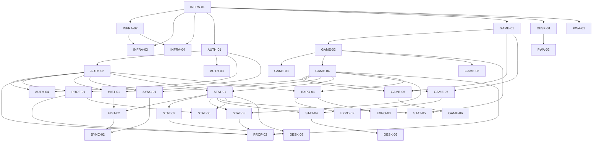

# Development Plan — Darts Training Companion

**FA version:** 1.8 (2026-03-07)
**TA version:** 1.1.0 (2026-03-07)
**Generated:** 2026-03-09

---

## Quick Stats

| Metric | Count |
|--------|-------|
| **Total stories** | 50 |
| **MVP stories** | 36 |
| **Post-MVP stories** | 14 |
| **Done** | 0 / 50 |

---

## Feature Overview

| Feature | Slug | Stories | MVP | Done |
|---------|------|---------|-----|------|
| Infrastructure & Project Setup | `infrastructure` | 4 | ✅ | 0 / 4 |
| Authentication & Account Management | `auth` | 4 | ✅ | 0 / 4 |
| Player Profiles & Settings | `profile` | 2 | ✅ | 0 / 2 |
| Score Tracking & Game Modes | `game-modes` | 8 | ✅ | 0 / 8 |
| Session History | `session-history` | 2 | ✅ | 0 / 2 |
| Multi-Device Sync | `sync` | 2 | ✅ | 0 / 2 |
| Statistics & Analytics | `stats` | 6 | ✅ | 0 / 6 |
| Desktop Experience | `desktop` | 3 | ✅ | 0 / 3 |
| Data Export | `export` | 3 | ✅ | 0 / 3 |
| PWA & Offline Support | `pwa` | 2 | ✅ | 0 / 2 |
| Training Drills | `drills` | 6 | ❌ Post-MVP | 0 / 6 |
| Leaderboards & Sharing | `leaderboards` | 5 | ❌ Post-MVP | 0 / 5 |
| Desktop Advanced | `desktop-advanced` | 2 | ❌ Post-MVP | 0 / 2 |
| Guest Mode | `guest-mode` | 1 | ❌ Post-MVP | 0 / 1 |

---

## Dependency Graph

---

## How to use this document as an agent

1. Find a story with status `🔲 Not started` whose dependencies are all `✅ Done`.
2. Update its **Status** to `🔄 In progress` and set **Agent** to your identifier before starting work.
3. Open the story file — it contains everything you need. Use the shared reference links for cross-cutting context.
4. If you are blocked, append `🚫 Blocked` to the status and add a note in the **Notes** column explaining why.
5. When done, set **Status** to `👀 Review`, fill in the **Output** link, and clear the **Agent** field.
6. After review is approved, the reviewer sets **Status** to `✅ Done`.

---

## Infrastructure & Project Setup

| Story | Phase | Status | Agent | Output | Notes |
|-------|-------|--------|-------|--------|-------|
| [INFRA-01 — Solution Scaffolding & Domain Model](features/infrastructure/infra-01-solution-scaffolding.md) | MVP | 🔲 Not started | — | — | — |
| [INFRA-02 — Docker Compose & Local Dev Environment](features/infrastructure/infra-02-docker-compose-local-dev.md) | MVP | 🔲 Not started | — | — | — |
| [INFRA-03 — CI/CD Pipeline](features/infrastructure/infra-03-ci-cd-pipeline.md) | MVP | 🔲 Not started | — | — | — |
| [INFRA-04 — Observability Setup](features/infrastructure/infra-04-observability-setup.md) | MVP | 🔲 Not started | — | — | — |

## Authentication & Account Management

| Story | Phase | Status | Agent | Output | Notes |
|-------|-------|--------|-------|--------|-------|
| [AUTH-01 — User Registration & Email Verification](features/auth/auth-01-user-registration/story.md) | MVP | 🔲 Not started | — | — | — |
| [AUTH-02 — Login & JWT Token Management](features/auth/auth-02-login-jwt/story.md) | MVP | 🔲 Not started | — | — | — |
| [AUTH-03 — Password Reset](features/auth/auth-03-password-reset/story.md) | MVP | 🔲 Not started | — | — | — |
| [AUTH-04 — Account Deletion](features/auth/auth-04-account-deletion/story.md) | MVP | 🔲 Not started | — | — | — |

## Player Profiles & Settings

| Story | Phase | Status | Agent | Output | Notes |
|-------|-------|--------|-------|--------|-------|
| [PROF-01 — Profile Management](features/profile/prof-01-profile-management/story.md) | MVP | 🔲 Not started | — | — | — |
| [PROF-02 — Home Screen](features/profile/prof-02-home-screen/story.md) | MVP | 🔲 Not started | — | — | — |

## Score Tracking & Game Modes

| Story | Phase | Status | Agent | Output | Notes |
|-------|-------|--------|-------|--------|-------|
| [GAME-01 — Game Setup & Mode Selection](features/game-modes/game-01-game-setup/STORY.md) | MVP | 🔲 Not started | — | — | — |
| [GAME-02 — 501/301 Score Entry & Bust Detection](features/game-modes/game-02-501-301-score-entry/STORY.md) | MVP | 🔲 Not started | — | — | — |
| [GAME-03 — Checkout Suggestions](features/game-modes/game-03-checkout-suggestions/STORY.md) | MVP | 🔲 Not started | — | — | — |
| [GAME-04 — Game Completion & Post-Game Summary](features/game-modes/game-04-game-completion/STORY.md) | MVP | 🔲 Not started | — | — | — |
| [GAME-05 — Cricket Pass-and-Play](features/game-modes/game-05-cricket-pass-and-play/STORY.md) | MVP | 🔲 Not started | — | — | — |
| [GAME-06 — Cricket Solo Score Drill](features/game-modes/game-06-cricket-solo-drill/STORY.md) | MVP | 🔲 Not started | — | — | — |
| [GAME-07 — Number Focus Session](features/game-modes/game-07-number-focus/STORY.md) | MVP | 🔲 Not started | — | — | — |
| [GAME-08 — Session Auto-Save & Resume](features/game-modes/game-08-session-auto-save/STORY.md) | MVP | 🔲 Not started | — | — | — |

## Session History

| Story | Phase | Status | Agent | Output | Notes |
|-------|-------|--------|-------|--------|-------|
| [HIST-01 — Session History List & Detail View](features/session-history/HIST-01-STORY.md) | MVP | 🔲 Not started | — | — | — |
| [HIST-02 — Session Deletion & Stats Recalculation](features/session-history/HIST-02-STORY.md) | MVP | 🔲 Not started | — | — | — |

## Multi-Device Sync

| Story | Phase | Status | Agent | Output | Notes |
|-------|-------|--------|-------|--------|-------|
| [SYNC-01 — Offline Session Queue & Auto-Sync](features/sync/SYNC-01-STORY.md) | MVP | 🔲 Not started | — | — | — |
| [SYNC-02 — Sync Conflict Detection & Resolution](features/sync/SYNC-02-STORY.md) | MVP | 🔲 Not started | — | — | — |

## Statistics & Analytics

| Story | Phase | Status | Agent | Output | Notes |
|-------|-------|--------|-------|--------|-------|
| [STAT-01 — Stats Dashboard & KPIs](features/stats/STAT-01-STORY.md) | MVP | 🔲 Not started | — | — | — |
| [STAT-02 — Trend Charts](features/stats/STAT-02-STORY.md) | MVP | 🔲 Not started | — | — | — |
| [STAT-03 — Personal Bests & PB Notifications](features/stats/STAT-03-STORY.md) | MVP | 🔲 Not started | — | — | — |
| [STAT-04 — Per-Game-Mode Breakdown & Number Focus Stats](features/stats/STAT-04-STORY.md) | MVP | 🔲 Not started | — | — | — |
| [STAT-05 — Scoring Distribution](features/stats/STAT-05-STORY.md) | MVP | 🔲 Not started | — | — | — |
| [STAT-06 — Weekly Summary](features/stats/STAT-06-STORY.md) | MVP | 🔲 Not started | — | — | — |

## Desktop Experience

| Story | Phase | Status | Agent | Output | Notes |
|-------|-------|--------|-------|--------|-------|
| [DESK-01 — Responsive Layout & Desktop Navigation](features/desktop/STORY-DESK-01.md) | MVP | 🔲 Not started | — | — | — |
| [DESK-02 — Enhanced Stats Dashboard (Desktop)](features/desktop/STORY-DESK-02.md) | MVP | 🔲 Not started | — | — | — |
| [DESK-03 — Number Focus Heat Grid (Desktop)](features/desktop/STORY-DESK-03.md) | MVP | 🔲 Not started | — | — | — |

## Data Export

| Story | Phase | Status | Agent | Output | Notes |
|-------|-------|--------|-------|--------|-------|
| [EXPO-01 — Export Infrastructure & CSV Export](features/export/STORY-EXPO-01.md) | MVP | 🔲 Not started | — | — | — |
| [EXPO-02 — Excel Export](features/export/STORY-EXPO-02.md) | MVP | 🔲 Not started | — | — | — |
| [EXPO-03 — JSON Export](features/export/STORY-EXPO-03.md) | MVP | 🔲 Not started | — | — | — |

## PWA & Offline Support

| Story | Phase | Status | Agent | Output | Notes |
|-------|-------|--------|-------|--------|-------|
| [PWA-01 — Service Worker, Offline Caching & Installability](features/pwa/STORY-PWA-01.md) | MVP | 🔲 Not started | — | — | — |
| [PWA-02 — Light & Dark Mode](features/pwa/STORY-PWA-02.md) | MVP | 🔲 Not started | — | — | — |

## Training Drills *(Post-MVP)*

| Story | Phase | Status | Agent | Output | Notes |
|-------|-------|--------|-------|--------|-------|
| [DRILL-01 — Built-in Drill Library](features/drills/DRILL-01.md) | Post-MVP | 🔲 Not started | — | — | — |
| [DRILL-02 — Starting a Drill Session](features/drills/DRILL-02.md) | Post-MVP | 🔲 Not started | — | — | — |
| [DRILL-03 — In-Drill Scoring & Guidance](features/drills/DRILL-03.md) | Post-MVP | 🔲 Not started | — | — | — |
| [DRILL-04 — Drill Completion & Results](features/drills/DRILL-04.md) | Post-MVP | 🔲 Not started | — | — | — |
| [DRILL-05 — Custom Drills](features/drills/DRILL-05.md) | Post-MVP | 🔲 Not started | — | — | — |
| [DRILL-06 — Drill Recommendations](features/drills/DRILL-06.md) | Post-MVP | 🔲 Not started | — | — | — |

## Leaderboards & Sharing *(Post-MVP)*

| Story | Phase | Status | Agent | Output | Notes |
|-------|-------|--------|-------|--------|-------|
| [LEAD-01 — Global Leaderboard](features/leaderboards/LEAD-01.md) | Post-MVP | 🔲 Not started | — | — | — |
| [LEAD-02 — Leaderboard Opt-Out](features/leaderboards/LEAD-02.md) | Post-MVP | 🔲 Not started | — | — | — |
| [LEAD-03 — Friends Leaderboard](features/leaderboards/LEAD-03.md) | Post-MVP | 🔲 Not started | — | — | — |
| [LEAD-04 — Sharing Stats & Achievements](features/leaderboards/LEAD-04.md) | Post-MVP | 🔲 Not started | — | — | — |
| [LEAD-05 — Achievements & Badges](features/leaderboards/LEAD-05.md) | Post-MVP | 🔲 Not started | — | — | — |

## Desktop Advanced *(Post-MVP)*

| Story | Phase | Status | Agent | Output | Notes |
|-------|-------|--------|-------|--------|-------|
| [DSKX-01 — Side-by-Side Game Mode Comparison](features/desktop-advanced/DSKX-01.md) | Post-MVP | 🔲 Not started | — | — | — |
| [DSKX-02 — Session Drill-Down / Replay View](features/desktop-advanced/DSKX-02.md) | Post-MVP | 🔲 Not started | — | — | — |

## Guest Mode *(Post-MVP)*

| Story | Phase | Status | Agent | Output | Notes |
|-------|-------|--------|-------|--------|-------|
| [GUEST-01 — Guest Mode](features/guest-mode/GUEST-01.md) | Post-MVP | 🔲 Not started | — | — | — |

---

## Shared Documents

- [Domain Model](shared/domain-model.md) — Entities, enums, relationships, database design notes
- [Architecture](shared/architecture.md) — Solution structure, layer rules, CQRS, ADRs, platform choices
- [API Contracts](shared/api-contracts.md) — All endpoints, CQRS commands/queries, FluentValidation rules
- [Non-Functional Requirements](shared/non-functional-requirements.md) — Performance, offline, GDPR, security, observability
