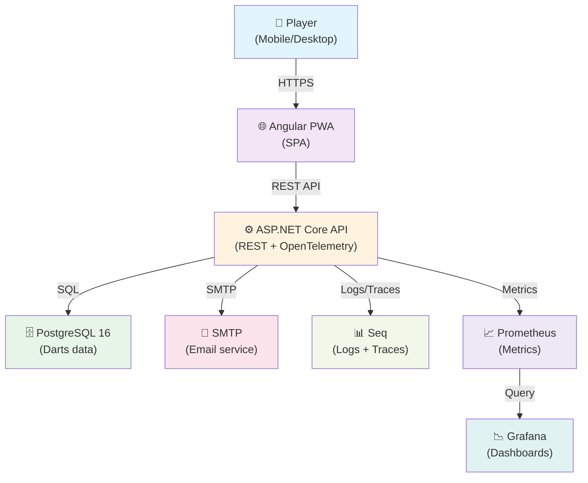

> **Shared reference document** — Architecture overview from Technical Architecture. All developers should understand system context, design decisions, and code structure before implementation.

# Architecture Overview

## System Context



---

## Key Architectural Decisions

### 1. **CQRS via MediatR (Application Layer Only)**
- Command Query Responsibility Segregation implemented at application layer via MediatR
- Single shared database; no read/write separation at infrastructure layer
- Each feature owns its Commands and Queries
- Validators colocated with Commands using FluentValidation
- Enables testability and scalability without operational complexity

### 2. **Authentication & Authorization**
- **Framework:** ASP.NET Core Identity (built-in, battle-tested)
- **JWT Tokens:** Access token (15-minute lifetime), Refresh token (7-day lifetime)
- **Email Verification:** Required for account activation
- **Password Security:** PBKDF2-HMAC-SHA512 (ASP.NET Identity default)
- **Token Storage:** Refresh tokens hashed in database, rotated on use

### 3. **Offline-First PWA**
- **In-Progress Games:** localStorage for fast read/write; small footprint
- **Sync Queue:** IndexedDB for queued commands waiting for network
- **Auto-Sync:** Triggered on reconnect; detects conflicts server-side
- **Offline Indicator:** UX clearly signals connectivity state
- **Fallback:** All features except leaderboards and sharing function offline

### 4. **Stats Recalculation**
- **Trigger:** User deletes a session → RecalculateStatsCommand enqueued
- **Implementation:** BackgroundService + Channel<Guid> (lightweight, in-memory queue)
- **Mechanism:** Processes queued UserId values; recomputes UserStats.StatsJson
- **UI Feedback:** GetRecalculationStatusQuery polled to show progress

### 5. **Export Generation**
- **Model:** ExportJob entity with Status field (Pending → Processing → Complete/Failed)
- **Implementation:** BackgroundService + ExportJob table
- **Delivery:** Streaming file download via DownloadExportQuery
- **Cleanup:** Temp files deleted after retention window

### 6. **Data Persistence**
- **Primary Store:** PostgreSQL 16 (relational, JSONB for flexible configs/stats)
- **ORM:** Entity Framework Core 10
- **Migrations:** Code-first via EF Core, tracked in git
- **Transactions:** ACID guarantees for critical operations (session creation, stats updates)

---

## Solution Structure

```
DartsCompanion.sln
├── src/
│   ├── DartsCompanion.Api/              # ASP.NET Core API project
│   │   ├── Controllers/                 # REST endpoints
│   │   ├── Middleware/                  # Auth, error handling, telemetry
│   │   ├── Program.cs                   # Startup config, DI container
│   │   └── appsettings.json             # Config (secrets via .env or Key Vault)
│   │
│   ├── DartsCompanion.Application/      # Business logic layer
│   │   ├── Auth/
│   │   │   ├── Commands/
│   │   │   ├── Queries/
│   │   │   └── Validators/
│   │   ├── Sessions/
│   │   │   ├── Commands/
│   │   │   ├── Queries/
│   │   │   └── Validators/
│   │   ├── Stats/
│   │   ├── Export/
│   │   ├── Common/                      # Interfaces, base classes
│   │   └── DependencyInjection.cs       # DI registration
│   │
│   ├── DartsCompanion.Domain/           # Domain entities, enums, interfaces
│   │   ├── Entities/                    # ApplicationUser, GameSession, etc.
│   │   ├── Enums/                       # GameMode, Hand, etc.
│   │   └── Interfaces/                  # IUnitOfWork, repositories
│   │
│   ├── DartsCompanion.Infrastructure/   # Data access, external services
│   │   ├── Persistence/
│   │   │   ├── DartsDbContext.cs        # EF Core DbContext
│   │   │   ├── Migrations/              # EF Core migrations
│   │   │   └── Repositories/            # Generic + specialized repositories
│   │   ├── Identity/                    # Identity service implementations
│   │   ├── Notifications/               # Email, SMS services
│   │   ├── BackgroundJobs/              # Stats recalc, export generation
│   │   ├── Telemetry/                   # OpenTelemetry setup
│   │   └── DependencyInjection.cs       # DI registration
│   │
│   └── DartsCompanion.Web/              # Angular PWA (separate git repo or monorepo subfolder)
│       ├── src/
│       │   ├── app/
│       │   │   ├── core/                # Auth service, API client, sync service
│       │   │   ├── features/            # Feature modules (auth, game, stats, etc.)
│       │   │   └── shared/              # Reusable components, models, charts
│       │   ├── assets/                  # Icons, splash screens
│       │   └── main.ts                  # Bootstrap
│       ├── angular.json                 # Build config
│       └── service-worker/              # PWA offline config
│
├── tests/
│   ├── DartsCompanion.UnitTests/        # Fast, isolated unit tests
│   ├── DartsCompanion.IntegrationTests/ # Tests against real DB, containers
│   └── DartsCompanion.E2E/              # Playwright e2e tests
│
├── docker/
│   ├── Dockerfile                       # API container image
│   ├── Dockerfile.web                   # PWA container (optional)
│   └── docker-compose.yml               # Local dev stack (API, DB, Seq, Mailhog)
│
├── docs/
│   ├── ARCHITECTURE.md                  # This file + diagrams
│   ├── API.md                           # Endpoint reference
│   ├── DEVELOPMENT.md                   # Local setup, common tasks
│   └── DEPLOYMENT.md                    # Prod deployment steps
│
└── .github/
    └── workflows/
        └── ci-cd.yml                    # GitHub Actions pipeline (self-hosted runner)
```

---

## Layering Rules & Dependencies

```
┌─────────────────────────────────────────┐
│  Api (Controllers, Middleware, DTOs)    │
│  ↓ (depends on)                         │
│  Application (Commands, Queries, Services)
│  ↓ (depends on)                         │
│  Domain (Entities, Enums, Interfaces)  │
│  ↓ (depends on)                         │
│  (no dependencies)                      │
└─────────────────────────────────────────┘

Infrastructure (Persistence, Email, Telemetry)
  ↓ (depends on)
  Application + Domain
  (no dependency on Api)
```

**Rules:**
- **Api** may depend on Application and Domain only
- **Application** may depend on Domain and Infrastructure only
- **Domain** has no external dependencies (except standard library)
- **Infrastructure** may depend on Application and Domain; never depends on Api
- Circular dependencies strictly prohibited

---

## Backend Feature-Folder Structure

Each feature (Auth, Sessions, Stats, Export) owns:

```
DartsCompanion.Application/Features/{FeatureName}/
├── Commands/
│   ├── CreateSessionCommand.cs          # Command definition + IRequest<T>
│   ├── CreateSessionCommandHandler.cs   # Handler + IRequestHandler<TRequest, TResponse>
│   ├── CreateSessionValidator.cs        # FluentValidation rules
│   └── CreateSessionCommandDTO.cs       # Request/response DTOs
├── Queries/
│   ├── GetSessionHistoryQuery.cs
│   ├── GetSessionHistoryQueryHandler.cs
│   └── GetSessionHistoryDTO.cs
└── Events/
    └── SessionDeletedEvent.cs           # Optional domain events
```

**Principles:**
- One Command/Query per file
- Handler and Validator in adjacent files
- DTOs define request shape and response contracts
- Validators run automatically via MediatR pipeline before handler execution

---

## Angular Application Structure

```
src/app/
├── core/
│   ├── auth/
│   │   ├── auth.service.ts              # Login, logout, token refresh
│   │   ├── auth.guard.ts                # Route protection
│   │   └── auth.interceptor.ts          # Bearer token injection
│   ├── api/
│   │   ├── api.client.ts                # HttpClient wrapper
│   │   └── endpoints/                   # Feature-specific API calls
│   ├── sync/
│   │   ├── sync.service.ts              # Offline queue, conflict resolution
│   │   ├── storage.service.ts           # localStorage + IndexedDB abstraction
│   │   └── conflict.resolver.ts         # Merge strategies
│   └── core.module.ts                   # DI registration
│
├── features/
│   ├── auth/
│   │   ├── login/
│   │   ├── register/
│   │   └── verify-email/
│   ├── game/
│   │   ├── new-game/
│   │   ├── game-board/
│   │   ├── score-entry/
│   │   └── game.service.ts
│   ├── stats/
│   │   ├── dashboard/
│   │   ├── trends/
│   │   └── personal-bests/
│   ├── history/
│   │   ├── session-list/
│   │   ├── session-detail/
│   │   └── filters/
│   ├── profile/
│   │   ├── profile-editor/
│   │   └── export/
│   └── leaderboard/
│       └── leaderboard-view/
│
├── shared/
│   ├── components/
│   │   ├── header/
│   │   ├── footer/
│   │   └── offline-indicator/
│   ├── charts/
│   │   ├── line-chart/
│   │   └── bar-chart/
│   ├── models/
│   │   ├── session.model.ts
│   │   ├── user.model.ts
│   │   └── stats.model.ts
│   ├── pipes/
│   │   ├── safe-html.pipe.ts
│   │   └── time-format.pipe.ts
│   ├── directives/
│   │   └── one-handed.directive.ts
│   └── shared.module.ts
│
├── app.module.ts                        # Root module
├── app-routing.module.ts                # App-level routes
└── app.component.ts                     # Root component
```

**Principles:**
- **core/:** Singleton services, guards, interceptors. Imported in AppModule, never re-provided
- **features/:** Lazy-loaded feature modules; each owns its routes, components, services
- **shared/:** Reusable UI components and utilities; imported by all features
- **Models:** Strong typing via TypeScript interfaces; generated from API contracts where possible

---

## Platform & Technology Choices

| Layer | Technology | Version | Rationale |
|-------|-----------|---------|-----------|
| **Backend Runtime** | .NET | 10 | Latest LTS, modern async/await, pattern matching |
| **Web Framework** | ASP.NET Core | 10 | Built-in Identity, EF Core, minimal APIs |
| **ORM** | Entity Framework Core | 10 | Code-first, migrations, LINQ queries |
| **Business Logic** | MediatR | 12 | CQRS, dependency injection, pipeline behaviors |
| **Validation** | FluentValidation | 11 | Fluent API, reusable, localization support |
| **Database** | PostgreSQL | 16 | JSONB, ACID, free and open-source |
| **Frontend Framework** | Angular | 21 | Mature, TypeScript, built-in RxJS, form tooling |
| **HTTP Client** | HttpClient | (Angular) | Async, interceptor support, strong typing |
| **PWA Runtime** | Service Worker | (Web API) | Offline, caching, background sync |
| **Local Storage** | localStorage + IndexedDB | (Web API) | Sync queue, game state persistence |
| **Containerization** | Docker + Compose | 26 | Multi-container local development |
| **CI/CD** | GitHub Actions | (self-hosted) | Free, native to GitHub, full control |
| **Logging** | Serilog + Seq | 4.x / latest | Structured logging, OpenTelemetry integration |
| **Observability** | OpenTelemetry + Prometheus + Grafana | latest | Industry standard, vendor-neutral, full stack |
| **Email (Dev)** | Mailhog | latest | Catches outbound email in dev; zero config |
| **Email (Prod)** | SendGrid / AWS SES | (service) | Reliable, scalable, proven |

---

## Architecture Decision Records (ADRs)

| ID | Title | Status | Summary |
|-----|-------|--------|---------|
| arch-001 | Single database with CQRS at application layer | Accepted | Avoids operational complexity of read-write DB split; MediatR provides logical separation |
| arch-002 | ASP.NET Core Identity for user auth | Accepted | Battle-tested, supports email verification, token rotation, password security |
| arch-003 | JWT + Refresh token pattern | Accepted | Stateless API, rotation prevents token replay; 15min access + 7day refresh balances security & UX |
| arch-004 | Offline-first PWA with sync queue | Accepted | Mobile-first product; localStorage for fast game entry, IndexedDB for queued commands |
| arch-005 | BackgroundService for stats recalc + export | Accepted | Lightweight, in-process; avoids external job queue complexity at v1.0 |
| arch-006 | Feature-folder organization + CQRS commands | Accepted | Cohesion; each feature owns routes, controllers, handlers, validators, DTOs |
| arch-007 | PostgreSQL JSONB for configuration & stats | Accepted | Flexible schema for game configs, stats aggregations; queryable, indexed |
| arch-008 | OpenTelemetry for observability | Accepted | Vendor-neutral, covers traces/metrics/logs; Seq + Prometheus/Grafana for visualization |
| sec-001 | Password reset via email token (not SMS) | Accepted | SMS costs, email integrated; token includes user ID + timestamp + signature |
| infra-001 | Docker Compose for local development | Accepted | Multi-container stack (API, DB, Seq, Mailhog) reproducible across machines |
| infra-002 | Self-hosted GitHub Actions runner | Accepted | Faster builds, no public IP exposure, full environment control; on-premises security |
| infra-003 | Migrations as code via EF Core + git | Accepted | Version control, code review, rollback via git; avoids manual SQL |

